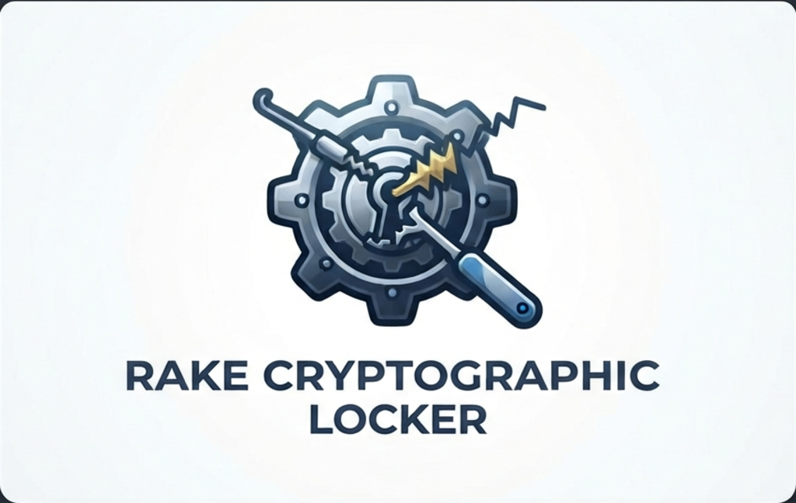
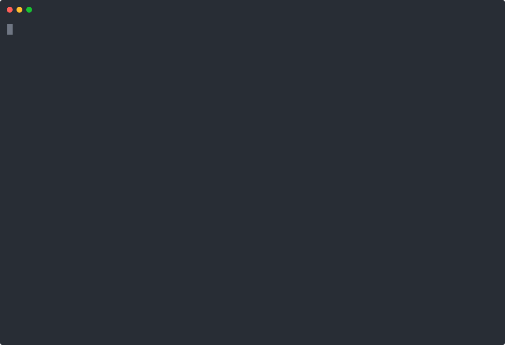

<p align="center">
  <br>
  
  <br>
  <br>
</p>

# Rake


A lightweight local cryptographic locker utility and offline CLI vault written in Python for Linux. 🚀


## Topics & Keywords
`cryptography` • `cli` • `security-tools` • `python` • `local-first` • `offline` • `linux-utility` • `encryption` • `vault`

---

## Why I Built This
Most open-source encryption tools or password managers are bloated, require cloud accounts, or force you through heavy setup processes just to securely hide a few sensitive text strings, API keys, or passwords. I wanted a zero-cloud, local-first CLI password vault that is dead-simple, completely offline, and lightweight—living right on the local machine without any internet connection, telemetry, or third-party tracking. 

## Under the Hood
* **Encryption & Security Model:** Uses **AES-128 in CBC mode** via the industry-standard Python `cryptography` library (`Fernet`) for authenticated symmetric encryption.
* **Key Derivation Function (KDF):** Uses **PBKDF2 with SHA-256** and 100,000 iterations combined with a unique random salt per entry to securely turn your master passphrase into a cryptographic key.
* **Privacy Assurance:** **What it does not do:** It doesn't use heavy databases, requires no external dependencies if you use the pre-compiled standalone binary, and **never** sends your data or keys anywhere over the internet—everything stays completely on your local machine.


## Why AES-128?
rake uses Fernet symmetric encryption, which mandates AES-128 in CBC mode paired with HMAC-SHA256 authentication. This provides an optimal balance of robust security, built-in tamper resistance, and zero configuration overhead without needing to reinvent custom cryptographic primitives.


## Storage & Security

* **Vault Location:** Rake initializes a local vault in a hidden directory (`~/.rake/`) within your home folder to ensure immediate, zero-friction setup out of the box. 
* **Local-First Isolation:** Keeping files isolated here ensures your encrypted data stays entirely on your machine, private, and completely out of accidental public paths or third-party cloud infrastructure.
* **Portable & Air-Gapped (Advanced):** Because the architecture is file-based rather than locked into a heavy database or cloud service, you aren't bound to your internal disk. If you want true physical cold storage, you can move your `.rake` directory to an external drive and map it via a symbolic link (`ln -s /path/to/external/.rake ~/.rake`). Unplug the drive, and zero ciphertext remains on the host machine.


## How to Run It
If you downloaded the pre-compiled binary file, open your terminal in the folder where the file is saved, make it executable, and run it with these commands:

```bash
cd ~/Downloads
mv rake-v1.0.0 rake
chmod +x rake
sudo mv rake /usr/local/bin/rake
```

Once installed, just type rake in your terminal.


## Demo

<p align="center">
  
</p>
